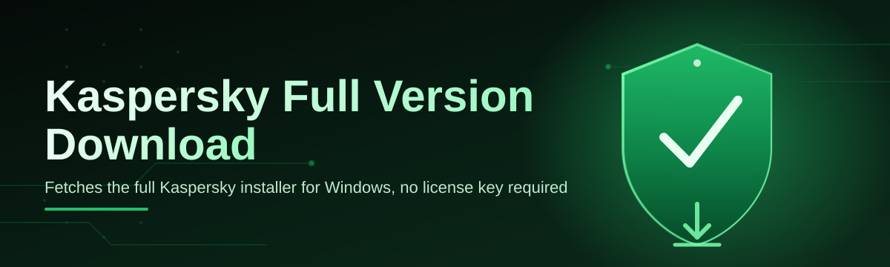

# kaspersky-full-suite-installer 🛡️✨

  

*One installer, every Kaspersky module, zero guesswork — the full suite, delivered the way setup should feel in 2026.*

---

## 🔎 Overview

Searching for a **Kaspersky full version download** usually means wading through mirror sites, mismatched build numbers, and installers that quietly bundle things you never asked for. `kaspersky-full-suite-installer` exists to fix that specific headache — it's a single, transparent orchestrator that fetches the components you choose, verifies them, and lays them down in the right order, every time.

This isn't a reskin of an installer. It's a **coordination layer** — think of it as a conductor standing in front of an orchestra of security modules (antivirus engine, firewall, VPN, password manager, parental controls) making sure they all come in on the right beat. No silent bundling, no dark-pattern checkboxes, no mystery toolbars. Just the suite, configured the way you told it to.

It's built for three kinds of people: the home user who wants full protection without babysitting a wizard, the IT tinkerer who needs a repeatable setup across a handful of machines, and the security-conscious downloader who just wants to *see* what's happening before clicking "next." If that's you, keep reading.

> [!NOTE]
> This project automates and orchestrates the **official Kaspersky full version download and install flow**. It does not modify, unlock, or redistribute proprietary binaries — it fetches them from the vendor and manages the sequence.

  

---

## 🚀 What Makes This Different

Every capability here was born from a real annoyance somebody had with the "normal" way of doing a Kaspersky full version download.

- **Component picker, not a bundle dump** — select antivirus, firewall, VPN, password manager, or the full stack. Nothing installs that you didn't check.

- **Resumable fetches** — lost connection mid-download? It picks up where it stopped instead of restarting a multi-gigabyte suite from zero.

- **Checksum-verified packages** — every module is hash-checked before install, so you know the bits on your disk match what shipped.

- **Silent & guided modes** — run it interactively with a clean wizard, or flip a flag for a no-prompt unattended pass across multiple machines.

- **Rollback safety net** — if a module install fails halfway, the installer reverts that step cleanly instead of leaving a half-configured suite behind.

- **Offline cache awareness** — already downloaded a component? It's reused, not re-fetched, saving bandwidth on repeat installs.

- **Localized UI** — the installer speaks more than one language out of the box, matching your Windows locale automatically.

- **Post-install health check** — a quick self-test confirms every selected module actually launched and registered correctly.

> [!TIP]
> Running this on more than one PC? Export your component selection as a small profile file and reuse it — same setup, every machine, in minutes.

---

## 🧭 How To Get Started

1. **Visit the landing page** — click the download button above or below, no signup walls in the way.

2. **Grab the installer** — a single lightweight `.exe` bootstraps everything else on demand.

3. **Run it** — pick your components, choose guided or silent mode, and let it fetch + install.

4. **Verify** — the built-in health check confirms every module is active before you close the window.

That's it. Four steps, no terminal required.

---

## 💻 System Requirements

| Requirement | Minimum | Recommended |
|---|---|---|
| OS | Windows 10 (64-bit) | Windows 11 (64-bit) |
| RAM | 2 GB | 4 GB+ |
| Disk space | 1.5 GB free | 3 GB+ free |
| Internet | Required for download | Broadband for full suite |
| Dependencies | None — fully standalone | None |

> [!IMPORTANT]
> No .NET runtime installs, no hidden dependency chains. The installer is self-contained and cleans up its own temp files when it finishes.

---

## ⚙️ How It Works

The flow behind every Kaspersky full version download run is intentionally boring — boring means predictable.

1. **Launch** — the bootstrapper checks your OS version and available disk space.

2. **Selection** — you pick components (or accept the full-suite default).

3. **Fetch** — each module downloads in parallel where safe, sequential where dependencies exist.

4. **Verify** — checksums are matched before anything touches your filesystem.

5. **Install & report** — modules install in dependency order, then the health check runs.

---

## 🩹 Troubleshooting

<strong>The download stalls at a specific percentage — what now?</strong>

Pause and resume it. The fetcher tracks byte offsets, so it continues from the stall point instead of restarting the whole component.

<strong>Windows Defender flags the bootstrapper on first run.</strong>

That's a common false-positive pattern for new, low-prevalence installers. Check the SHA256 listed on the landing page against your downloaded file to confirm integrity, then allow it through.

<strong>Can I install just the antivirus engine, not the whole suite?</strong>

Yes — deselect everything else in the component picker. The full suite is an option, never a requirement.

<strong>Silent mode finished but no UI ever appeared — is that normal?</strong>

Yes, that's the point of silent mode. Check the generated log file in the install directory for a step-by-step summary.

<strong>Health check reports one module as "unreachable."</strong>

Usually a firewall or VPN service that hasn't finished registering yet. Reboot once and re-run the health check from the tray icon.

---

## 🎨 UI / UX Details

- **Themes** — light, dark, and a system-matched auto mode.

- **Keyboard shortcuts:**

    - `Ctrl + N` — start a new install profile

    - `Ctrl + S` — save current component selection

    - `Ctrl + Enter` — begin install with current settings

    - `Esc` — cancel current step safely

- **Settings panel** — bandwidth cap, retry limits, and cache location all live under one gear icon, no digging through menus.

> [!WARNING]
> Cancelling mid-install (`Esc`) during the "Install" phase rolls back the *current* module only — previously completed modules stay installed.

---

## 🤝 Contributing & Community

  

We keep the bar simple:

- Open an issue before a big PR — saves everyone a rewritten diff later.

- Small, focused pull requests merge faster than sprawling ones.

- Be kind in discussions. Security tooling attracts strong opinions; we welcome the opinions, not the heat.

> [!TIP]
> First-time contributor? Look for issues tagged `good-first-issue` — they're scoped to be small, real, and mergeable.

---

## 📜 License

Released under the [MIT License](LICENSE), 2026.

---

## ⚠️ Disclaimer

This project automates the retrieval and installation flow for the official Kaspersky full version download. It is an independent, community-maintained tool and is not affiliated with, endorsed by, or officially connected to Kaspersky Lab. All trademarks belong to their respective owners. Use at your own discretion.

  

